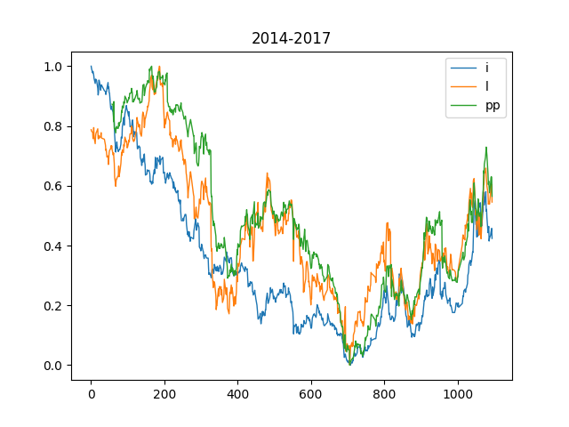
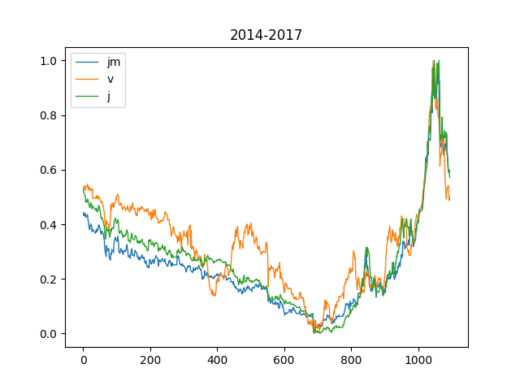
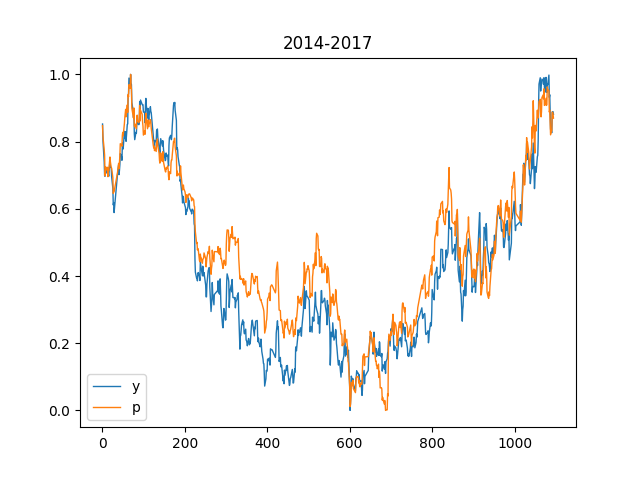

Report

* 首先计算了两两商品的相关性，采用皮尔森相关系数，结果如下：

20140101-20170101的Top10：
* ['j', 'jm', 0.9842833129514772]
* ['y', 'p', 0.9568244692740074]
* ['l', 'pp', 0.9509038413287036]
* ['c', 'cs', 0.9319922520551293]
* ['j', 'v', 0.9155444534100441]
* ['jm', 'v', 0.8974634298427201]
* ['i', 'pp', 0.8974264335843334]
* ['pp', 'bb', 0.8568676881544437]
* ['i', 'l', 0.8458467973303913]
* ['y', 'b', 0.8325716689654183]

* 对于大于两个商品之间的相关系数，采用绝对值相乘的方式计算，下列是3、4个商品之间的相关系数的Top 10：

* ['j', 'jm', 'v', 0.8087537717769612]
* ['i', 'l', 'pp', 0.7218171035958687]
* ['l', 'pp', 'bb', 0.6256616509989426]
* ['l', 'pp', 'm', 0.6091980865646952]
* ['i', 'pp', 'bb', 0.6036455384676177]
* ['y', 'b', 'p', 0.6033858751646565]
* ['i', 'pp', 'm', 0.5949543559308034]
* ['j', 'jm', 'p', 0.5739088727925925]
* ['v', 'y', 'p', 0.5707988965213711]
* ['j', 'v', 'p', 0.5584678266951543]

* ['i', 'l', 'pp', 'm', 0.3755745401643715]
* ['i', 'l', 'pp', 'bb', 0.37282023384213914]
* ['j', 'jm', 'v', 'p', 0.370933930280388]
* ['j', 'jm', 'v', 'y', 0.330838792404451]
* ['j', 'v', 'y', 'p', 0.3026929954191903]
* ['j', 'jm', 'y', 'p', 0.29619784453318093]
* ['l', 'pp', 'm', 'bb', 0.29295199105224085]
* ['i', 'pp', 'm', 'bb', 0.29248377209345655]
* ['jm', 'v', 'y', 'p', 0.2781567309146119]
* ['i', 'pp', 'a', 'bb', 0.2502641713874662]

* 由以上数据找出的几组不相容的高相关商品： ['l', 'pp', 'i'], ['j', 'jm', 'v'], ['y', 'p'], 如图：
* 
* 
* 